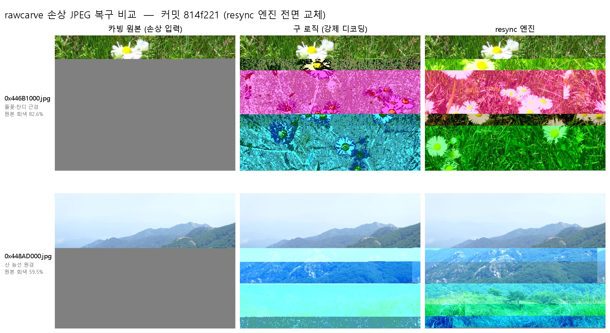

# 복구 결과 비교 보고서 — resync 엔진 vs 구(舊) 복구 로직

- **날짜:** 2026-06-04
- **대상/범위:** 커밋 `814f221`(resync 전면 교체) 전후 산출물. **(1) 케이스 스터디** 손상 JPEG 2건(비교용 풍경 샘플)의 카빙 원본 → 구 로직 → resync 3단계 시각·수치 대조. **(2) 전체 배치** 동일 입력 812개에 대한 구 로직(`output/jpeg_recovered_old`) vs resync(`output/jpeg_recovered_new`) 집계 비교.
- **한 줄 요약:** 구 로직은 디싱크를 구조적으로 풀지 못한 채 강제 디코딩으로 회색만 덮고 디싱크 다수를 "정상"으로 놓쳤다. resync 엔진은 비트스트림을 실제 재정렬해 더 많이(549 vs 341)·정직하게 복원하며, 못 푸는 영역은 회색으로 남긴다.
- **관련 문서:** [ADR 0001 resync 복구](../adr/0001-resync-recovery.md), [spec 0002 recover](../specs/0002-recover.md), [reference jpeg-entropy-coding](../reference/jpeg-entropy-coding.md), [investigation 2026-06-03](../investigations/2026-06-03-jpeg-gray-desync-recovery.md)

---

## 1. 한눈에 보기

왼쪽부터 **카빙 원본(손상 입력) → 구 로직 → resync 엔진**, 위가 `0x446B1000`, 아래가 `0x448AD000`.

- **카빙 원본:** 상단만 정상이고 손상 지점부터 끝까지 회색. 디코더가 가짜 마커에서 스캔을 멈춘 것.
- **구 로직:** 회색은 사라졌지만 손상부 전체가 자홍/청록 **단색 띠**로 변질. 구조가 소실됐다.
- **resync 엔진:** 손상부의 본래 구조·자연색이 살아났고, 진짜 복구 불가 지점만 얇은 잔여 색편이/소량
  회색으로 정직하게 남는다.

전체 배치(812개)에서도 같은 우위가 수치로 확인된다: resync는 **549개를 복원**(구 로직 341개)하고,
구 로직이 손상 없다고 **"정상" 판정한 193개에서 디싱크를 추가로 찾아 복원**했다(§5).

## 2. 배경 — 손상의 정체는 "비트스트림 디싱크"

baseline JPEG의 엔트로피 스캔은 바이트 경계가 없는 연속 비트열이다. 단 한 바이트가 손상되면
허프만 디코딩이 **비트 위치 기준에서 어긋나고(디싱크)**, RST 앵커가 없으면 그 어긋남이
파일 끝까지 번진다. 디싱크는 두 얼굴로 나타난다(→ [reference/jpeg-entropy-coding](../reference/jpeg-entropy-coding.md)):

- **회색(GRAY_MCU):** 어긋난 비트열이 우연히 가짜 마커(`FF xx`)를 만들면 디코더가 스캔을
  중단하고 이후 MCU를 회색(YCbCr 중립, 128)으로 채운다.
- **깨짐:** 가짜 마커를 만들지 않으면 디코더는 멈추지 않고 **틀린 계수로 계속 진행**해
  엉뚱한 색·구조를 출력한다. 특히 DC 차분이 어긋나면 색차(Cb/Cr)가 누적되어 단색 띠가 된다.

따라서 "회색을 없애는 것"과 "디싱크를 푸는 것"은 전혀 다른 문제다. 이 보고서의 핵심은 이 구분이다.

## 3. 두 엔진이 하는 일

### 3.1 구 로직 (`carver/diagnosis.py` + `carver/recovery.py`, 814f221에서 삭제됨)

1. 헤더/세그먼트를 파싱해 스캔 범위 안의 `FF xx`(xx ≠ 00, D0–D9) 위반을 수집(`BAD_STUFF`).
2. 위반 바이트의 둘째 바이트를 `0x00`으로 **중화**(`_patch_bad_stuff`) → 가짜 마커 제거.
3. PIL로 **강제 디코딩**(`LOAD_TRUNCATED_IMAGES`) 후 `Image.save`로 재인코딩.
4. 8×8 블록 단위로 회색(128±2) 비율을 측정(`detect_damaged_blocks`), 너무 손상되면 컷/스킵.

→ 본질은 **"가짜 마커만 지우고 강제로 끝까지 디코딩"**. 비트 위치 어긋남 자체는 건드리지 못한다.
`FF→00` 중화로 회색(스캔 중단)은 사라지지만, 디코더는 그 지점부터 **디싱크된 채로 진행**하므로
손상부가 통째로 깨진 색으로 채워진다.

### 3.2 resync 엔진 (`carver/jpegdecode.py` + `carver/resync.py`, 814f221 도입)

1. **numba 비트 단위 baseline 디코더**(`jpegdecode.py`)로 임의 시작 비트위치/DC에서 디코딩을
   재개하며, 무효 허프만 코드·계수 dequant 오버플로(`DC_BOUND=1400`, `AC_BOUND=6000`)·비트레이트로
   **디싱크 지점을 정확히 짚는다**.
2. 디싱크 지점마다 **바이트 오라클**로 단일바이트 손상을 교정: 치환(`sub`)/삭제(`del`)/삽입(`ins`)을
   시도해 정렬을 보존한 채 복원(밀림 없음).
3. 단일바이트로 안 풀리면 **resync-skip**: 재개 비트위치를 넓게 탐색(`resync_near`)해 다중바이트
   손상/구멍을 건너뛴다. 단, `db≈0` masking(가짜 복구)은 거부한다.
4. 좌→우 단방향 처리라 편집·세그먼트가 항상 현재 지점 이후에만 일어나 이전 비트위치가 안전하다.
   끝내 복구 불가한 영역만 **회색으로 남긴다(hole) — 가짜 채움 금지**.

→ 본질은 **"비트스트림을 실제로 재정렬"**. 그래서 회색도 줄고 손상부 구조도 살아난다.

## 4. 케이스 스터디 — 풍경 샘플 2건

> 측정 대상: `0x446B1000.jpg`, `0x448AD000.jpg`(둘 다 2816×2112). 카빙 원본은 EXIF 보존(`FFE1`),
> 두 복구본은 JFIF 재인코딩(`FFE0`). 배치 전체 통계는 §5.

### 4.1 카빙 원본은 "정답"이 아니라 손상 입력

원본 파일은 PIL 표준 디코딩에서 `broken data stream`으로 끝까지 읽히지 않는다.
`LOAD_TRUNCATED_IMAGES`로 강제 디코딩하면 상단 일부만 정상이고 나머지는 회색으로 채워진다.

| 파일 | 정상 디코딩 영역 | 회색 비율 | 손상 시작 |
|------|------------------|-----------|-----------|
| `0x446B1000` | 상단 ~368/2112 행 | 82.6% | 약 17% 지점 |
| `0x448AD000` | 상단 ~856/2112 행 | 59.5% | 약 40% 지점 |

→ 픽셀 단위 "정답"이 존재하지 않는다. 그래서 평가는 **(a) 원본 정상영역 보존 여부(수치)**
**+ (b) 손상영역 복원의 시각적 타당성**으로 한다.

### 4.2 원본 정상영역(상단) 보존 — 둘 다 충실

원본이 올바르게 디코딩한 행에 한정한 MAE(평균 절대 오차, 0–255):

| 파일 | 구 로직 MAE@정상영역 | resync MAE@정상영역 |
|------|----------------------|-------------------|
| `0x446B1000` | 2.2 | 1.7 |
| `0x448AD000` | 0.6 | 0.8 |

두 엔진 모두 이미 멀쩡한 상단부는 그대로 보존(MAE ≈ 0~2, 재인코딩 양자화 오차 수준). 즉 차이는
오직 손상부 처리에서 갈린다.

### 4.3 손상영역 — 여기서 갈린다

`report.csv` 지표:

| 지표 | 구 로직 | resync |
|------|----------|------|
| action | `RECOVERED_PATCHED` | `RECOVERED` |
| 446B 회색 | (전) 0.827 → **복구 블록 0.000** | (전) 0.834 → **(후) 0.018** |
| 448A 회색 | (전) 0.595 → **복구 블록 0.000** | (전) 0.433 → **(후) 0.007** |
| 446B 연산 | — | ops 5 = sub 1 / resync 4 / **hole 1** |
| 448A 연산 | — | ops 5 = sub 3 / resync 2 / **hole 1** |

> "(전)" 회색은 각 엔진이 **자기 디코더로** 측정한 값이다. resync의 비트 디코더는 PIL보다 더 멀리
> 디코딩하므로 `0x448AD000`의 초기 회색이 더 낮게 잡힌다(구 로직 0.595 vs resync 0.433) — §4.1의
> PIL 기준 59.5%와의 차이도 같은 이유.

- **구 로직 — `recovered_block_pct = 0.000`(이 두 샘플 한정):** 두 샘플 모두 복원 블록 0. 화면상
  회색은 사라졌지만 디싱크를 푼 게 아니라 강제 디코딩으로 메운 것. 손상 지점 아래 전체가 색차
  디싱크로 **단색 띠**가 되어 원래 구조가 소실된다. 회색을 "보이지 않게" 만든 **위장 복구**.
  (배치 전체에서 구 로직의 `recovered_block_pct`는 평균 0.094 — 항상 0은 아님. §5.3.)
- **resync — gray 83.4%→1.8%, 43.3%→0.7%:** 디싱크 지점마다 sub/resync로 비트스트림을 재정렬.
  - `0x446B1000`: 단일바이트 치환 1회 + resync-skip 4회로 손상부를 되살리고, 끝내 못 푼 1구간만
    회색(hole, 잔여 1.8%)으로 남김.
  - `0x448AD000`: 치환 3회 + resync-skip 2회 + hole 1. 잔여 회색 0.7%.
  - 복원된 손상부는 본래 구조·자연색을 회복하고, 진짜 복구 불가 지점만 얇은 색편이/소량 회색으로
    **정직하게** 남는다.

### 4.4 출력 파일 특성

| 항목 | 원본 | 구 로직 | resync |
|------|------|----------|------|
| 446B 크기 | 1.04 MB | 1.03 MB | 2.36 MB |
| 448A 크기 | 1.04 MB | 0.65 MB(컷) | 1.92 MB |
| 헤더 | EXIF(`FFE1`) | JFIF 재인코딩 | JFIF 재인코딩 |
| 양자화(DC 첫 계수) | — | qDC=5 | qDC=2 |

- 구 로직은 `0x448AD000`을 cut_offset 179.6 KB에서 **잘라내** 0.65 MB로 축소 — 손상부를 폐기하는
  전략이었음을 파일 크기가 드러낸다.
- resync는 더 낮은 양자화(qDC 5→2, 고품질 테이블)로 재인코딩 → 복원된 디테일을 보존, 파일 크기 ~2배.

## 5. 전체 배치 분석 — 동일 입력 812개

두 `report.csv`(`output/jpeg_recovered_new` = resync, `output/jpeg_recovered_old` = 구 로직, 각 812행)를
파일명 기준으로 교차 대조했다.

### 5.1 처리 결과 분포

| | resync(신) | 구 로직 |
|---|-----------|---------|
| 복원 | **RECOVERED 549** | RECOVERED_PATCHED 331 + RECOVERED_DECODED 10 = **341** |
| 무손상 | CLEAN 145 | CLEAN 349 |
| 스킵 | SKIP_UNDECODABLE 118 | SKIP_FALSE_POSITIVE 90 + SKIP_TOO_DAMAGED 32 = 122 |

resync는 구 로직보다 **+208개(549 vs 341, +61%)** 많이 복원한다. 스킵 규모는 비슷(118 vs 122).

### 5.2 교차표 (구 로직 → resync) — 어디서 차이가 나나

| 구 로직 | → resync | 파일 수 | 해석 |
|---------|----------|--------|------|
| CLEAN | RECOVERED | **193** | 구 로직이 "정상"이라 놓친 디싱크를 resync가 탐지·복원 |
| CLEAN | CLEAN | 136 | 둘 다 무손상 동의 |
| CLEAN | SKIP | 20 | 구 로직이 통과시킨 구조적 불능 파일을 resync가 정직하게 거부 |
| RECOVERED | RECOVERED | 324 | 둘 다 복원(처리 방식은 force-decode vs resync로 상이) |
| RECOVERED | SKIP | 12 | 구 로직이 강제 출력했으나 resync는 디코딩 불능으로 거부 |
| RECOVERED | CLEAN | 5 | — |
| SKIP | RECOVERED | **32** | 구 로직이 포기한 파일을 resync가 복원 |
| SKIP | SKIP | 86 | 둘 다 포기 |
| SKIP | CLEAN | 4 | — |

**가장 큰 발견:** 구 로직이 손상 없다고 판정한 349개 중 **193개에 실제로는 디싱크가 있었다.**
구 로직의 탐지는 `BAD_STUFF`(가짜 마커 `FF xx`)에만 의존하므로, **가짜 마커를 만들지 않는 디싱크
(=깨짐의 얼굴, §2)를 통째로 놓친다.** resync는 비트 단위 디코더로 이를 잡아낸다.

### 5.3 복원의 질 — 구 로직은 회색만 덮고, resync는 더 줄이며 정직 회색을 남긴다

- **구 로직:** `recovered_block_pct` 평균 0.094, 최대 0.895, >0인 파일 136개. 즉 회색을 일부 줄이긴
  하나(강제 디코딩 부작용으로 색차 띠 동반), 평균 9%대로 낮고 디싱크 자체는 미복원.
  또한 **363개 파일에서 cut_offset을 설정해 손상 꼬리를 잘라냈다** — 데이터 폐기 전략.
- **resync(복원 549개):** 회색 비율 `gray_before` 평균 0.517(중앙 0.543) → `gray_after` 평균 0.298
  (중앙 0.163). 편집 연산 `ops` 합계 2,584회 = sub 1,475 / del 1 / ins 161 / resync-skip 947.
  이와 별도로 **hole 202**(끝내 못 푼 미복원 구간, ops에 미포함).

  잔여 회색(`gray_after`) 분포:

  | 잔여 회색 | 파일 수 |
  |-----------|--------|
  | < 1% | 25 |
  | 1–5% | 107 |
  | 5–20% | 167 |
  | > 20% | 250 |

  복원 파일의 약 46%(250개)는 여전히 20% 넘는 회색을 남긴다 — **밀집 손상은 가짜로 채우지 않고
  정직하게 회색으로 남기는** 설계의 결과(가짜 채움 금지). 화면을 채우되 깨뜨리는 구 로직과 정반대의
  트레이드오프다.

### 5.4 배치 요약

resync는 (a) 구 로직이 놓친 디싱크 193개 + 포기한 32개를 추가 복원하고, (b) 복원한 영역의 회색을
실제로 더 줄이며, (c) 구조적 불능 파일은 강제 출력(구 로직) 대신 정직하게 SKIP한다. 비용은
밀집 손상 파일의 잔여 회색(정직한 미복원)과 처리 시간(철저 모드)이다.

## 6. 기각한 측정 — 자동 색차 지표로는 품질을 못 가른다

처음엔 색차 채도(YCbCr의 Cb/Cr 크기)로 "깨짐"을 정량화하려 했으나 실패했다:

| 파일 | 원본 meanChroma | 구 로직 | resync |
|------|------------------|----------|------|
| 446B | 6.1 | 55.4 | 54.9 |
| 448A | 7.7 | 45.9 | 47.6 |

원본은 회색 채움 영역의 채도가 0이라 평균 채도가 비정상적으로 낮고, **색을 채우기만 하면**
(잘못 채우든 옳게 채우든) 채도는 똑같이 올라간다. 고채도 픽셀 비율(>60)은 오히려 resync가 더 높게
나오기도 했다 — resync가 복원한 **선명하지만 올바른 색**(꽃·초목)을 지표가 "과채도 깨짐"과 구분하지
못하기 때문. **선명·정상 vs 선명·오류를 자동으로 가를 수 없다**는 것이 이 시도의 결론이며, 이것이
시각 비교가 결정적 평가가 되는 이유다.

## 7. 결론

1. **카빙 원본은 손상 입력**이다(상단만 유효, 하단 59~83% 회색). 비교는 "정답 대비 정확도"가
   아니라 **정상부 보존 + 손상부 복원 타당성**으로 평가해야 한다.
2. **구 로직의 탐지에는 구조적 사각지대가 있다.** 가짜 마커(`BAD_STUFF`)에만 의존해, 마커를 만들지
   않는 디싱크(깨짐)를 놓친다 — 배치에서 "정상" 판정 193개가 실제로는 디싱크였다(§5.2). 복원하더라도
   강제 디코딩이라 디싱크를 풀지 못하고(케이스 스터디 2건은 복구 블록 0), 회색을 색차 띠로 덮을 뿐.
3. **resync 엔진이 본질을 복원하고 더 많이 복원한다.** 배치에서 549개 복원(구 로직 341개, +61%).
   디싱크를 바이트 단위(sub/del/ins) + resync-skip으로 재정렬해 회색을 줄이고(케이스 83%→2%,
   43%→0.7%; 배치 평균 0.517→0.298) 손상부 구조를 되살린다.
4. **resync는 못 푸는 영역을 정직하게 남긴다.** 밀집 손상 파일은 회색(hole) 유지 — 복원 549개 중
   46%가 잔여 회색 >20%. 화면을 채우되 깨뜨리는 구 로직과 정반대 트레이드오프. 구조적 불능 파일도
   강제 출력 대신 SKIP(구 로직이 처리한 32개를 resync는 정직 거부).
5. 두 엔진 모두 **원본 정상영역은 손상 없이 보존**(MAE ≈ 0~2) — 차이는 전적으로 손상부 처리.
6. **자동 색차 지표는 품질 판별 불가** — 시각 비교 + 엔진 자체 지표(gray_before/after, ops 분해)가
   유효한 평가 수단.

이 비교는 ADR 0001(resync 채택)과 spec 0002의 "회색=마커정지·깨짐=어긋난진행, FF00 중화로는
불충분" 판단을 케이스 스터디와 배치 통계 양쪽에서 재확인한다.

## 8. 한계 및 후속

- 케이스 스터디는 풍경 2건뿐 — 인물/저주파/고주파 등 콘텐츠별 시각 일반화는 별도 검증 필요.
- 픽셀 단위 ground truth가 없어 손상부 복원의 **절대 정확도는 미측정**(시각 타당성·회색 비율로 대체).
  배치 비교도 두 로직의 스키마가 달라(구: `recovered_block_pct` / 신: `gray_after`) 직접 동일 척도가
  아니다.
- resync 복원 549개 중 46%가 잔여 회색 >20%(§5.3) — 밀집 손상의 정직한 미복원. 이런 파일은 화면이
  대부분 회색이라 "복원됨(RECOVERED)"이어도 실사용 가치는 제한적이다.
- resync의 잔여 색편이 띠(hole 직전 구간)는 resync-skip이 밝기·밀림을 보류 항목으로 둔 결과 —
  spec 0002의 알려진 한계.

## 9. 사용한 방법·도구

- 비교 몽타주: `assets/2026-06-04-resync-comparison.webp` (PIL로 3단계×2샘플 합성, 맑은 고딕 라벨, WebP q92).
- `PIL.ImageFile.LOAD_TRUNCATED_IMAGES`로 손상 원본 강제 디코딩 후 행별 채널 표준편차/평균으로
  회색 채움 행 판정.
- 원본 정상영역 마스크에 한정한 MAE로 정상부 보존 측정.
- YCbCr Cb/Cr 채도 프로파일(기각된 지표, §6).
- 배치: 두 `report.csv`를 파일명 기준 교차 대조(action 분포, 교차표, `gray_before/after`·`ops`·
  `recovered_block_pct`·`cut_offset` 집계).
- `im.quantization`·헤더 마커(`FFE1`/`FFE0`)로 재인코딩·품질 차이 확인.
- 구 로직 코드는 `git show 814f221^:carver/recovery.py`·`:carver/diagnosis.py`로 열람.
