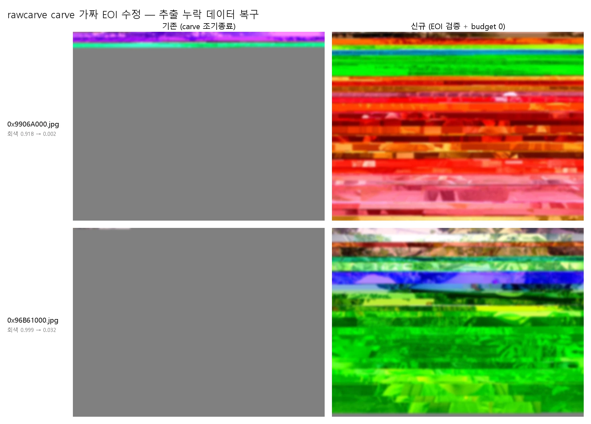

# 보고서 — carve 가짜 EOI 수정: 추출 누락 데이터 복구

- **날짜:** 2026-06-29
- **대상/범위:** `feat/carve-eoi-validation` 전후. 동일 `usb.img`를 (구)·(신) carve로 재추출(`output` vs `output_v2`)하고, recover를 budget 90s/무제한으로 재복구. 공통 JPEG 809개 + 회색 잔존 의심 92개.
- **한 줄 요약:** 복구 후 회색 잔존의 주원인은 데이터 소실이 아니라 **carve가 가짜 `FF D9`를 EOI로 오인해 이미지의 ~30%만 추출한 "추출 누락"**이었다. EOI 검증으로 누락을 되살려 의심 92개 중 26개(앞부분이 잘렸던 것)를 복구했고(`gray` 중앙 0.708→0.073), **악화 0**. 단 커진 파일을 끝까지 복구하려면 recover budget 무제한(`--time-budget 0`)이 필수다.
- **관련 문서:** [ADR 0002 carve EOI 검증](../adr/0002-carve-eoi-validation.md), [spec 0001 carve](../specs/0001-carve.md), [reference jpeg-markers §3](../reference/jpeg-markers.md), [investigation 2026-06-29 규명 과정](../investigations/2026-06-29-carve-eoi-discovery.md), [ADR 0001 resync 복구](../adr/0001-resync-recovery.md)

---

## 1. 한눈에 보기

위 `0x9906A000`, 아래 `0x96B61000`. 왼쪽 **기존**(가짜 EOI에서 잘려 대부분 회색) → 오른쪽 **신규**(EOI 검증 + `--time-budget 0` 복구). 결과 이미지는 개인정보 보호를 위해 블러 처리했다. 회색이 "복구 실패"가 아니라 "추출 누락"이었음을 보여준다.

복구 후에도 회색이 남던 파일들의 **진짜 원인은 carve였다.** 손상으로 stuffing이 깨진 자리에 우연히 생긴 `FF D9`를 carve가 EOI로 오인해 파일을 ~30%에서 잘랐고, 나머지 데이터(파일당 1.9–2 MB)는 디스크에 멀쩡히 있는데도 버려졌다. recover는 없는 데이터를 복구할 수 없으니 회색으로 남긴 것 — 정직했지만, 회색은 복구 실패가 아니라 **추출 누락**이었다.

| 핵심 결과 | 값 |
|-----------|-----|
| 재추출 JPEG | 812 → **822** |
| 가짜 EOI 수혜로 커진 파일 | 246개 (+74 MB) |
| 의심 92개 중 **추출 누락**(복구됨) | **26개** (`gray` 중앙 0.708→**0.073**) |
| 의심 92개 중 **진짜 소실**(정직 회색) | 66개 (56개 크기 불변) |
| 전체 `gray_after` ≥ 30% | 101 → **78** |
| 악화 | **0** |

## 2. 배경 — 회색은 "복구 실패"가 아니라 "추출 누락"이었다

resync 엔진(ADR 0001)은 "물리적으로 소실된 영역은 회색으로 남긴다(가짜 채움 금지)"는 원칙이다. 그래서 복구 후 회색이 크게 남은 파일들(812개 중 `gray_after`≥30% + `hole` 발생 92개)은 **데이터 소실**로 해석되어 왔다.

바이트 단위 재분석은 다른 결론을 냈다. `carver/extractors.py::jpeg_end`는 SOS 이후 **첫 `FF D9`**를 EOI로 보고 파일을 끝냈는데, 손상된 엔트로피 스트림에서는 stuffing(`FF`→`FF 00`)이 깨진 자리에 **우연한 `FF D9`**가 생긴다. carve가 이를 진짜 EOI로 오인한 것이다.

**증거(투입 전 확인):**
- 잘린 끝 이후 디스크 데이터가 고엔트로피(≈7.97 bit/byte) + "`FF` 다음 `00`/RST" 비율 97–99%(= JPEG 엔트로피 연속).
- 디스크에서 진짜 끝까지 가져와 복구하니 `gray` 0.728→0.014, 0.777→0.144로 이미지 콘텐츠가 복원됐다.
- 잘린 끝의 `FF D9` 직후 stuffing 비율이 가짜(엔트로피 연속)는 0.5–1.0, 진짜 EOI/패딩은 0.0–0.13으로 갈렸다.

## 3. 방법

- **carve 수정(ADR 0002):** `jpeg_end`가 `FF D9` 후보를 순회하며 직후 4 KB의 stuffing 비율(`_stuffing_ratio`)이 **0.3 이상**이면 가짜로 보고 다음 후보로 전진. 상한은 엔트로피 이후 다음 JPEG 헤더(`_next_header`, `FF D8 FF E0`–`EF`)로 두어 다음 파일 침범을 막는다.
- **재추출:** `python carve.py usb.img -o output_v2` (기존 `output`은 보존).
- **재복구:** `python recover.py output_v2/jpeg -o output_v2/jpeg_recovered`를 budget 90s(기본)와 `--time-budget 0`(무제한)으로 각각 수행.
- **측정:** 추출 파일 크기(`output` vs `output_v2`), `report.csv`의 `gray_after`·`action`·`hole`을 파일명 기준 교차 대조.

## 4. 결과

### 4.1 carve 추출 — 누락 데이터 복구 + 과추출 제한

| 변화 | 내용 |
|------|------|
| 추출 개수 | 812 → 822 (+10) |
| **커짐(가짜 EOI 수혜)** | **246개, +74 MB** |
| └ 극적(앞부분 잘림) | `*3F2` 6개 3 KB→2.8 MB(×700+), `0x96B61000` 247 KB→3 MB, `0x99C35000` 149 KB→2.7 MB |
| └ 미미(끝부분 잘림) | 다수, 크기 중앙 22 KB→24 KB |
| 과추출 제한(부수) | 6개, 254 MB→10 MB 등 (-546 MB) |
| 묻혔다 노출된 파일 | 13개 |

가짜 EOI 수정 효과는 **양극화**됐다. 대부분은 EOI가 거의 끝에 있어 약간만 커졌고(중앙 22→24 KB), 소수는 앞부분에서 잘려 극적으로 복구됐다(3 KB→2.8 MB). 총 +74 MB는 이 소수가 주도한다.

**부수 효과 — fallback 과추출 제한.** 기존 `jpeg_end`는 EOI를 못 찾으면 `next_sig`(다음 시그니처)까지 추출했는데, 다음 시그니처가 멀면 그 사이 전체를 삼켰다(`0x7235A000`은 **254 MB**까지). 이들은 모두 정상 2816×2112 카메라 JPEG으로, 진짜 데이터(보통 1–3 MB)는 앞쪽에 있고 나머지는 잉여였다. 새 코드는 `_next_header` + 10 MB 상한으로 이를 제한했다(2816×2112가 10 MB 초과는 비현실적이므로 데이터 손실 아님). 과추출 파일 안에 묻혀 embedded로 스킵되던 시그니처 13개도 별도 파일로 노출됐다.

### 4.2 recover — 의심 92개 중 26개가 추출 누락이었다

회색 잔존 의심 92개(`output` 기준 `gray_after`≥0.3 + `hole`)를 budget 무제한 재복구와 대조:

| 구분 | 수 | 해석 |
|------|----|------|
| **개선** | **26** | 파일이 커진 것(23/26이 1.5×+) = 가짜 EOI로 잘렸던 데이터 복구. `gray` 중앙 **0.708→0.073** |
| 동일 | 66 | 56/66이 크기 거의 불변 = **진짜 데이터 소실**(carve로도 못 가져옴). 정직한 회색 |

전체로는 `gray_after`≥30%가 **101→78개**(23개 해소), 기존 대비 **개선 32 / 악화 0 / 동일 645**. 즉 회색 잔존의 약 **28%(26/92)는 carve 버그였고**, 나머지는 물리적 소실이다.

큰 개선 사례 — carve 추출 크기가 커진 만큼(누락 데이터 복구) 회색이 줄었다:

| 파일 | carve 크기 (구→신) | gray (기존→budget0) |
|------|------|------|
| `0x96B61000` | 247 KB → 3.0 MB | 0.999 → **0.032** |
| `0x9906A000` | 895 KB → 3.0 MB | 0.918 → **0.002** (hole=0 완전) |
| `0x43AEE000` | 57 KB → 1.0 MB | 0.990 → **0.099** |
| `0x9F549000` | 914 KB → 2.9 MB | 0.728 → **0.014** |
| `0x92007000` | 1.2 MB → 3.0 MB | 0.681 → **0.010** |

### 4.3 budget 교훈 — 커진 파일엔 무제한 복구가 필수

가짜 EOI 수정으로 파일이 1.9–2 MB 커지면서, recover 기본 budget 90s가 **부족**해졌다. budget을 키우지 않으면 오히려 악화한다:

| recover budget | 기존 대비 | 비고 |
|----------------|-----------|------|
| 90s (기본) | 개선 20 / **악화 119** | 커진 파일이 시간 내 일부만 복구 → 회색 |
| 무제한(`--time-budget 0`) | 개선 32 / **악화 0** | budget 90s 대비 **142개 추가 개선** |

예: `0xA8B9A000`(3 MB)은 budget 90s에서 `gray` 0.896이었으나, 무제한(132s 소요)에서 **0.011**로 완전 복구됐다. 즉 budget 90s의 악화 119개는 **회귀가 아니라 시간 부족**이었다. 파일이 커진 만큼 복구 시간도 늘어야 한다.

## 5. 결론·권고

1. **회색 잔존의 주원인은 carve의 가짜 EOI 오인**이었다 — resync의 복구 실패가 아니라 추출 누락. 의심 92개 중 26개(~28%)가 이에 해당하며, EOI 검증으로 복구됐다(`gray` 중앙 0.708→0.073).
2. **나머지 66개는 진짜 데이터 소실**(56개 크기 불변)로, carve로도 되살릴 수 없는 정직한 회색이다.
3. **악화 0** — EOI 검증은 정상 파일을 망치지 않는다(오판해도 recover가 전체 MCU를 채우면 멈춰 잉여를 무시. ADR 0002 §결정).
4. **부수 효과로 fallback 과추출(최대 254 MB)을 10 MB로 제한**해 잉여를 제거하고 묻혀 있던 13개 파일을 노출했다.
5. **권고:** 재추출 후 복구는 반드시 `--time-budget 0`(또는 충분히 큰 budget)으로 한다. 파일이 커진 만큼 기본 90s는 부족하며, 이를 어기면 악화한다.

## 6. 한계

- 진짜 소실 66개는 복구 불가(물리적 데이터 없음).
- carve가 되살린 데이터를 recover가 못 넘는 경우는 **resync 엔진 자체를 개선해야 하는 과제**다(carve 수정과는 별개 축). 예: `0xA1F57000`은 데이터가 24% 남았는데 resync가 DC를 캐리만 해서 hole로 멈춘다 — DC=0 리셋 시 `gray` 0.461→0.274(단 색 캐스트 발생)이고, 잔여는 비트 폭식 손실이다. 상세·후속 방향: [investigation 2026-06-29](../investigations/2026-06-29-resync-limit.md).
- 색 캐스트·밝기 밴드·밀림은 여전히 미해결(ADR 0001 알려진 한계).
- 엔트로피 중 우연한 `FF D8 FF E0`–`EF`(4바이트) 매칭이 상한을 오판할 수 있으나 확률 ~1/2³²로 매우 드묾(실측 3파일 정확).
- budget 무제한은 10 MB 과추출 잔여 파일에서 복구 시간이 길다(전체 822개 ~30–60분).

## 7. 사용한 방법·도구

- carve 재추출: `carve.py usb.img -o output_v2`. 재복구: `recover.py output_v2/jpeg -o output_v2/jpeg_recovered --time-budget 0`. budget 90s 결과는 `output_v2/report_b90.csv`에 백업.
- 파일 크기 비교: `output/jpeg` vs `output_v2/jpeg`의 파일별 `os.path.getsize` 교차 대조(증가/감소 분리, 배수 분포).
- gray 비교: 세 `report.csv`(`output`=구, `report_b90`=신 90s, `output_v2`=신 무제한)를 파일명 기준 교차 대조(`gray_after`·`action`·`hole`).
- 의심 파일 정의: `output` 기준 `gray_after`≥0.3 AND `hole`≥1.
- 비교 몽타주: `assets/2026-06-29-carve-eoi-comparison.webp` — `0x9906A000`·`0x96B61000`의 before(기존 carve+복구)/after(신 carve+budget0), 결과 이미지는 블러 처리(GaussianBlur r=3), 맑은 고딕 라벨.
