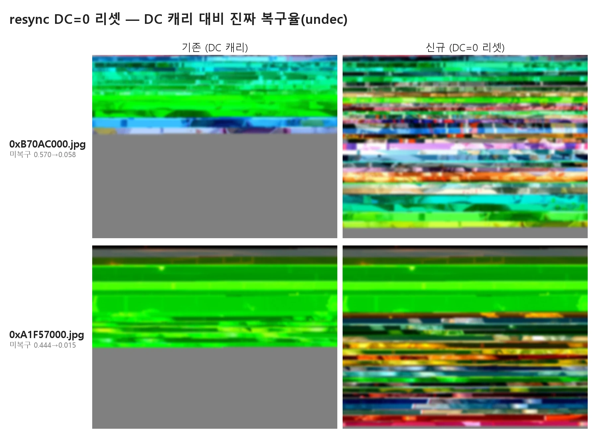

# 보고서 — resync DC=0 리셋: 재동기 실패 회색 복구 + 진짜 복구율 지표(undec) 도입

- **날짜:** 2026-07-01
- **대상/범위:** `feat/resync-dc-reset` 전후. 동일 `output/jpeg` 822개를 (구)DC 캐리 · (신)DC=0 리셋 resync로 재복구(`output/jpeg_recovered` vs `output/jpeg_recovered_v2`), 모두 `--time-budget 0`(무제한).
- **한 줄 요약:** resync 복구가 재동기에 실패해 남긴 회색을, 재개 지점의 밝기 기준값(DC)을 0으로 리셋해 복구했다. 진짜 복구율(미복구 회색 비율)이 복구본 평균 0.100→0.092로 내려갔고, 회색이 크게 남던 대표 파일은 0.570→0.058·0.444→0.015로 대부분 복구됐다. 분류 붕괴·악화는 없었다(악화 3/700, 0.4%). 함께, 겉보기 지표(gray)가 이 개선을 감추는 **지표 착시**를 규명하고 이를 걷어내는 지표(undec)를 도입했다.
- **관련 문서:** [ADR 0004](../adr/0004-resync-dc-reset-recovery.md), [recover 스펙](../specs/0002-recover.md), [분석 과정(dc-reset)](../investigations/2026-07-01-resync-dc-reset.md), [회색 원인·한계](../investigations/2026-07-01-resync-skew-underconsumption.md)

---

## 1. 한눈에 보기

왼쪽 **기존**(DC 캐리): 위쪽은 복원됐으나 아래쪽이 통째로 회색(=복원 못 한 영역). 오른쪽 **신규**(DC=0 리셋): 아래쪽 회색이 실제 내용으로 채워졌다. 결과 이미지는 개인정보 보호를 위해 블러 처리했다. 색 얼룩·가로 줄무늬는 이번 작업 범위 밖(별도 과제)이며, 이번에 개선한 것은 **회색(정보 없음) → 내용(정보 복원)** 부분이다.

| 핵심 결과 | 값 | 의미 |
|-----------|-----|------|
| 복구본 **미복구 회색(undec)** 평균 | 0.100 → **0.092** | 데이터 없어 못 채운 영역이 진짜로 줄었다 |
| 대표 파일 미복구 회색 | `0xB70AC000` 0.570→**0.058**, `0xA1F57000` 0.444→**0.015** | 회색이 절반 이상이던 파일이 대부분 복원 |
| 분류(정상/복구/실패) | 143 / 557 / 122 → **동일** | 잘 되던 파일을 망치지 않음 |
| 악화(진짜 회귀) | **3 / 700 (0.4%)** | 미미, 모두 손상이 심한 파일 |
| 겉보기 지표(gray) | 0.156 → 거의 불변 | **지표 착시** — 아래 3절 참조 |

**용어**(이 보고서 한정):
- **미복구 회색(undec)**: 데이터가 없어 복원하지 못해 균일한 회색으로 남은 영역의 비율(0~1). 낮을수록 좋다.
- **겉보기 회색(gray)**: 무채색이면서 평탄한 픽셀의 비율. DC=0 리셋이 만드는 "색 없는 정상 내용"까지 회색으로 잘못 세는 한계가 있다(3절).

## 2. 배경 — 회색의 일부는 "복원 실패"였다

손상된 사진 파일은 데이터 정렬이 어긋나(디싱크) 복구 도구가 중간에서 멈추고 그 뒤를 회색으로 남긴다. resync 복구 엔진은 멈춘 지점에서 다시 정렬을 잡아(재동기) 복원을 이어간다. 그런데 재동기하려면 그 지점의 **밝기 기준값(DC)**이 필요한데, 기존 엔진은 이를 직전 값으로 이어받기만(캐리) 했다. 이 기준값이 틀리면 재동기에 실패하고 회색이 남았다.

`0xA1F57000`에서 측정한 결과, 직전 값으로 이어받으면 재개 후 137블록만에 다시 멈췄지만(실패), 기준값을 0으로 리셋하면 900블록 이상 이어졌다. 즉 회색의 일부는 물리적 데이터 소실이 아니라 **재동기 실패**였다.

## 3. 방법 — DC=0 리셋과 "착시 없는 지표"

- **DC=0 리셋:** 재동기 지점을 탐색할 때 밝기 기준값을 직전 값(캐리)과 **0으로 리셋한 값** 두 가지로 시도해, 더 길게 이어지는 쪽을 택한다. 색차 기준값까지 함께 0으로 두는데(색은 재동기에 거의 영향이 없다), 이 때문에 복원된 영역에 **무채색(색 빠짐)**이 생긴다. 색 보정은 별도 과제다.
- **지표 착시 규명과 undec 도입:** 기존 지표(gray)는 "무채색 + 평탄"을 회색으로 센다. DC=0 리셋이 만든 무채색 내용을 회색으로 **잘못 집계**하므로, gray로는 개선이 안 보인다. 그래서 "데이터가 없어 못 채운 회색(정확히 회색값)"만 세는 **undec** 지표를 새로 도입해 `report.csv`에 함께 기록했다.

**측정:** 같은 822개를 구·신 엔진으로 각각 무제한 복구하고, 파일명 기준으로 undec·gray·분류를 교차 대조했다.

## 4. 결과

### 4.1 진짜 복구율은 개선, 겉보기 지표는 착시로 불변

복구된 파일(557개)의 미복구 회색(undec) 평균이 **0.100 → 0.092**로 내려갔다. 반면 겉보기 회색(gray)은 0.156에서 거의 그대로였다 — DC=0이 만든 무채색 내용을 gray가 회색으로 잘못 세기 때문이다. **지표를 잘못 보면 "효과 없음"으로 오판할 수 있다**는 뜻이다.

전체 평균 개선폭(0.008)이 작은 이유는, 대부분 파일이 이미 잘 복구돼 있고 **회색이 크게 남던 소수 파일에서만 크게 개선**되기 때문이다:

| 파일 | 미복구 회색 (구→신) |
|------|------|
| `0xB70AC000` | 0.570 → **0.058** |
| `0xA1F57000` | 0.444 → **0.015** |
| `0xBA5F6000` | 0.365 → **0.040** |
| `0xBD866000` | 0.250 → **0.041** |

### 4.2 분류 붕괴·악화 없음

- 파일 분류(정상 복사 143 / 복구 557 / 복구 불가 122)가 구·신 **동일**했다 = 잘 처리되던 파일을 망치지 않았다.
- 겉보기 지표상 악화로 보인 103개 중 100개는 무채색 착시였고, **진짜로 나빠진 것은 3개(700개 중 0.4%)**뿐이며 모두 원래 손상이 심한 파일에서 미복구 회색이 소폭(+0.01~0.03) 늘었다.

## 5. 결론·권고

1. **회색 잔존의 일부는 재동기 실패였고, DC=0 리셋으로 복구된다.** 회색이 크게 남던 파일이 특히 크게 개선된다(예: 0.570→0.058).
2. **지표를 올바로 봐야 한다.** 겉보기 회색(gray)은 DC=0의 무채색 내용을 회색으로 잘못 세므로, 진짜 복구율은 **undec**로 판단한다. `report.csv`에 두 지표를 함께 기록한다.
3. **악화 0.4%** — 잘 되던 파일을 망치지 않는다. 안전하게 적용 가능.

## 6. 한계

- **전체 평균 개선폭은 작다(0.008).** 대부분 파일이 이미 복구돼 있어, 이득은 회색이 크게 남던 소수 파일에 집중된다.
- **무채색(색 빠짐)은 미해결.** DC=0 리셋은 복원한 영역의 색을 잃는다. 진짜 복구율(정보 유무)에는 영향이 없고 색·겉보기 품질만의 문제이나, 색 보정은 별도 과제다.
- **남은 회색의 상당수는 데이터 한계다.** 데이터를 이미 다 쓴(소진) 파일의 회색은 재동기로 복구되지 않는다([회색 원인 조사](../investigations/2026-07-01-resync-skew-underconsumption.md)).

## 7. 사용한 방법·도구

- 복구: `python recover.py output/jpeg -o output/jpeg_recovered_v2 --time-budget 0`(신), 대조군은 구 엔진의 `output/jpeg_recovered`.
- 지표 수치: `output/jpeg_recovered{,_v2}/report.csv`의 `undec_after`·`gray_after`·`action`을 파일명 기준 교차 대조. 구 엔진 report에는 undec 컬럼이 없어 복구본 이미지에서 `undecoded_fraction`으로 재계산(복구본 557개 평균 0.100 vs 0.092).
- 대표 파일 수치: 5개 고정 샘플의 구·신 복구본 undec 직접 측정(`0xB70AC000` 0.570→0.058 등).
- 비교 몽타주: `tools/montage.py`로 생성, 결과 이미지 블러(GaussianBlur r=3).
